# Hi There 👋

-   🔭 I’m currently working on code related things of epic awesomeness.
-   🌱 I’m currently learning the shortcut to stopping shortcuts.
-   🤔 I’m looking for help with true randomness.
-   😄 Pronouns: He/Him.
-   ⚡ Fun fact: 42.

## Github & Coding Stats

    
     
    

## Languages & Quotes

    
    

